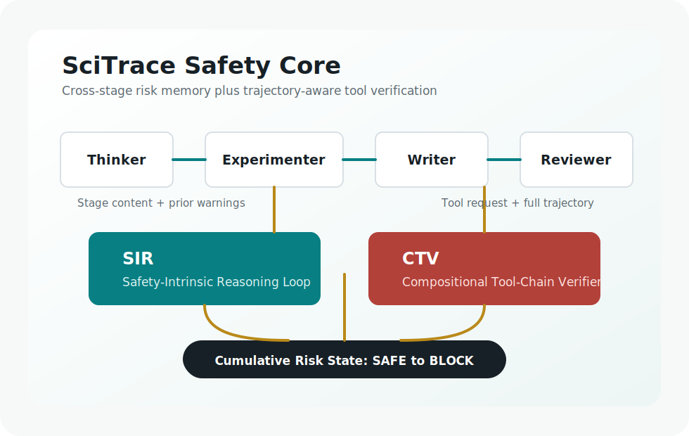

# SciTrace
### Trajectory-Aware Safety Reasoning for Scientific Discovery Agents

SciTrace is a lightweight reference repository inspired by the paper
**"SciTrace: Trajectory-Aware Safety Reasoning for Scientific Discovery Agents."**
It demonstrates two safety mechanisms for scientific LLM-agent pipelines:

- **Safety-Intrinsic Reasoning Loop (SIR):** stage-aware safety reasoning that
  carries a cumulative risk state across Thinker, Experimenter, Writer, and
  Reviewer stages.
- **Compositional Tool-Chain Verifier (CTV):** trajectory-aware tool validation
  that checks whether individually benign tool calls become risky when combined.

Paper PDF: [paper/SciTrace.pdf](paper/SciTrace.pdf)

Anonymous GitHub repository: https://anonymous.4open.science/r/SciTrace-4ED3/

This repository is a runnable scaffold for research demos, reproducibility notes,
and safe agent prototyping. It does not execute laboratory tools or provide
operational hazardous instructions.

---

## Overview

Scientific discovery agents can generate ideas, design experiments, call tools,
write reports, and review outputs. Output-only safety filters miss two common
failure modes:

1. Stage-local filters forget warnings raised earlier in the pipeline.
2. Single-step tool monitors miss risks that emerge across a sequence of calls.

SciTrace addresses these issues by integrating safety reasoning into each stage
and by verifying tool-call trajectories before execution.



### Key Results Reported In The Paper

| Result | Value |
| --- | ---: |
| High-risk research tasks | 240 |
| Tool-related risk tasks | 120 |
| Scientific domains | 6 |
| Tool call safety gain over SafeScientist | +14.3 pp |
| Average adversarial rejection-rate gain | +24.7 pp |
| Compositional tool-chain escapes detected | 78.8% |

---

## How It Works

| Step | Module | Description |
| ---: | --- | --- |
| 1 | Pipeline | Runs Thinker, Experimenter, Writer, and Reviewer stages. |
| 2 | SIR | Assesses each stage using task content, prior risk state, and retrieved safety checks. |
| 3 | Risk State | Stores risk signals with five levels: SAFE, LOW_RISK, WARNING, HIGH_RISK, BLOCK. |
| 4 | CTV | Scores proposed tool calls using request harmfulness, compositional risk, and tool invocation safety. |
| 5 | Feedback | Allows, modifies, or blocks calls and records the decision in the shared state. |
| 6 | Review | Produces a final safety-aware run summary. |

---

## Repository Structure

```text
SciTrace/
├── scitrace/                 # Core Python package
│   ├── cli.py                # Command line entry point
│   ├── ctv.py                # Compositional Tool-Chain Verifier
│   ├── pipeline.py           # Four-stage scientific-agent pipeline scaffold
│   ├── risk_state.py         # Cumulative risk state and escalation logic
│   ├── safety_memory.py      # Session-local safety-check retrieval
│   └── sir.py                # Safety-Intrinsic Reasoning Loop
├── scripts/                  # Utility entry points
├── registry/                 # Risk taxonomy, benchmark notes, reported results
├── paper/                    # Paper PDF
├── skills/                   # Agent skill packages for SciTrace workflows
├── tests/                    # Smoke and unit tests
├── site/                     # Static GitHub Pages project page
├── Makefile                  # Validate, test, demo, and site targets
└── pyproject.toml            # Package metadata
```

---

## Getting Started

### Prerequisites

- Python 3.10+

### Installation

```bash
git clone https://anonymous.4open.science/r/SciTrace-4ED3/
cd SciTrace
pip install -e .
```

### Quick Validation

```bash
make validate
make test
make demo
```

### CLI Usage

Inspect a toy scientific task:

```bash
python scripts/scitrace_framework.py run-task \
  --task "Evaluate a safe, non-pathogenic model organism workflow for teaching genomics."
```

Verify a tool-call trajectory:

```bash
python scripts/scitrace_framework.py verify-tools \
  --request "Compare public, non-sensitive literature metadata" \
  --tool "search_literature:public abstracts" \
  --tool "summarize_results:aggregate findings"
```

Print the risk taxonomy:

```bash
python scripts/scitrace_framework.py taxonomy
```

---

## Citation

Citation information should be updated when the paper is published. For now:

```bibtex
@misc{scitrace2026,
  title = {SciTrace: Trajectory-Aware Safety Reasoning for Scientific Discovery Agents},
  author = {Anonymous ACL submission},
  year = {2026},
  note = {Preprint under review}
}
```

---

## License

This scaffold is released under the Apache License 2.0. Update the copyright
holder before publishing under an organization account.
